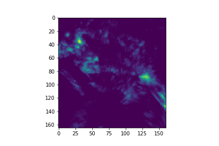

# persiann_api

The __persiann_api__ python package was built in order to make data more readily available for data scientist, analyst, etc, that wish to work with weather data through the [PERSIANN](https://chrsdata.eng.uci.edu/) database. __It is not an official API for the PERSIANN project__.

The PERSIANN database is made from the "system developed by the Center for Hydrometeorology and Remote Sensing (CHRS) at the University of California, Irvine (UCI) uses neural network function classification/approximation procedures to compute an estimate of rainfall rate at each 0.25° x 0.25° pixel of the infrared brightness temperature image provided by geostationary satellites."

As our API currently download the data in the GeoTIFF format, every "pixel" in the .tiff file would be the value of the rainfall rate at the 0.25° x 0.25° space.


The screenshot above was taken from https://chrsdata.eng.uci.edu/, which is the official site for the PERSIANN project. This was taken from Brazil in the 28th of December!

# Installation

Install it throught pip or [Poetry](https://python-poetry.org/), if you already have the [gdal](https://pypi.org/project/GDAL/) package.

```bash
pip install persiann_api
```
```bash
poetry add persiann_api
```

The *gdal* package is not so easy to straightforward install. Click in this link for the official guide in PyPi, click [here](https://pypi.org/project/GDAL/). 

There is also this guide for Ubuntu users, click [here](https://mothergeo-py.readthedocs.io/en/latest/development/how-to/gdal-ubuntu-pkg.html). This is the summary for Ubuntu users:

```bash

sudo add-apt-repository ppa:ubuntugis/ppa && sudo apt-get update
sudo apt-get update
sudo apt-get install gdal-bin

ogrinfo --version
```

Then, install the specific version of GDAL from the previous output.

```bash
sudo apt-get install libgdal-dev
export CPLUS_INCLUDE_PATH=/usr/include/gdal
export C_INCLUDE_PATH=/usr/include/gdal

pip install GDAL==[SPECIFIC VERSION FROM THE 'ogrinfo' OUTPUT]
```

# Usage

The API has one main function that downloads the data inside a folder given some parameters.

```python
from persiann_api.main import download_data
from PIL import Image

# downloads daily data and store each data from date inside the folder.
download_data(
    from_date=datetime.date(2021, 12, 28),
    to_date=datetime.date(2021, 12, 28),
    folder='data/',
    # bounding box for Brazil
    lat_bb=(-35, 6),
    lon_bb=(-69, -36)
)
# read the GeoTIFF with your favorite package
geotiff_path = 'data/2021_12_28.tiff'
arr = np.asarray(Image.open(geotiff_path, mode='r'))[::-1] # we must mirror the array for the GeoTIFF.
plt.imshow(arr)
plt.clim(0, 78)
```



See? This is the same data as the first original data!

This is a longer example to put here, but in the [notebooks](notebooks/testing_persiann_api.ipynb) folder you can find the code to generate this picture:

